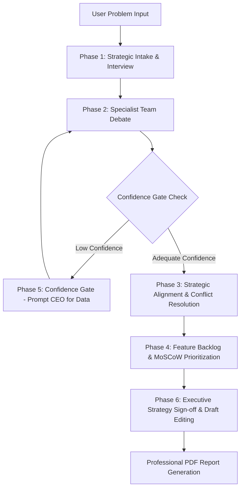

# 🧠 AI Product Strategy Workspace (CEO Mode)

A multi-agent decision-making system that simulates how cross-functional product teams collaborate to solve product strategy problems with a human in the loop.

## Overview

The **AI Product Strategy Workspace** is an interactive, multi-agent simulation that transforms open-ended product challenges into executive-ready strategy reports. Instead of relying on a single large language model (LLM) response, the workspace distributes analysis across six specialized AI agents representing distinct corporate roles. 

Designed for leaders, product managers, developers, and strategists, this system integrates a human **CEO (Chief Executive Officer) in the loop** to guide debate, resolve key conflict points, customize prioritization directives, and approve the final compiled deliverables.

## Motivation

While LLMs excel at generating answers, they often obscure the reasoning process and trade-offs behind a specific recommendation. In real-world organizations, successful strategic decisions are rarely unilateral; they emerge through collaborative debates and tension between departments (e.g., product management, engineering, data science, and user research). 

This project simulates this collaborative process to answer:
> *"How would an entire cross-functional product team reason through this problem, and how can a leader guide them to the optimal decision?"*

## Features

- **Human-in-the-Loop Integration (CEO Mode)**: Pauses execution at key alignment checkposts to let the human CEO approve, reject, or edit directives.
- **Multi-Agent Deliberation**: Uses 7 specialized agents (6 specialists, 1 coordinator) with tailored system prompts governing their behavior.
- **Adaptive Intake Interview**: Starts with a 3-question adaptive clarification phase to narrow down the target audience, constraints, and success criteria before the team debate.
- **Parsed Recommendation Blocks**: Dynamically extracts confidence levels (`High`/`Medium`/`Low`), key assumptions, and critical risks from raw agent responses using parsed metadata tags.
- **CEO Override & Reconsideration**: Lets the CEO provide direct feedback to force agents to reconsider their opinions or override proposals with custom strategic mandates.
- **Conflict Resolution (Decision Points)**: Automatically pauses execution when the Team Manager detects alignment mismatches, prompting the CEO to select the strategic direction.
- **MoSCoW Backlog Prioritization**: Allows the CEO to assign priority buckets (Must, Should, Could, Won't Have) to backlog items proposed by the team.
- **Confidence Gates**: Pauses execution to request additional information (like customer interviews or mock data files) if any specialist agent reports "Low" confidence.
- **Draft Synthesis Editor**: Exposes editable text areas for each section of the report (Executive Summary, Recommendations, Roadmap, Risks) prior to final compilation.
- **Professional PDF Compiler**: Outputs a formatted, print-ready PDF executive report using a robust ReportLab layout structure.

## Architecture

The system coordinates the multi-agent team sequentially using Microsoft AutoGen's AgentChat API. The flow consists of four primary internal stages:



### The Specialist Agents
1. **Product Manager (`product_manager`)**: Drives target framing, core product positioning, value propositions, and initial feature backlogs.
2. **User Researcher (`user_researcher`)**: Focuses on qualitative customer feedback, personas, pain points, and behavioral assumptions.
3. **Data Scientist (`data_scientist`)**: Evaluates metrics, KPIs, instrumentation plans, and hypothesis validation frameworks.
4. **Software Engineer (`engineer`)**: Identifies technical feasibility, developer effort, architectural dependencies, and MVP constraints.
5. **Growth Lead (`growth_lead`)**: Explores user acquisition loops, monetization, viral loops, and retention strategies.
6. **Devil's Advocate (`devils_advocate`)**: Challenges consensus, stress-tests ideas, and highlights critical blind spots.
7. **Team Manager (`manager`)**: Coordinates the debate rounds, extracts key discussion targets, calls out alignment conflicts, and synthesizes final recommendations.

## Tech Stack

| Component | Technology | Description |
| :--- | :--- | :--- |
| **Core Runtime** | Python 3.10+ | Primary language environment |
| **Agent Orchestration** | Microsoft AutoGen (AgentChat API) | Orchestrates agent conversations and lifecycle loops |
| **User Interface** | Streamlit | Provides the responsive frontend with custom styled panels |
| **PDF Generation** | ReportLab | Compiles the formatted, publication-ready PDF summaries |
| **Configuration** | python-dotenv | Handles environment-level configurations and secrets |

## Project Structure

```
app/
├── agents/
│   ├── base.py                 # Shared AssistantAgent build factories & instructions
│   ├── data_scientist.py       # Data Scientist specialized prompt
│   ├── devils_advocate.py     # Devil's Advocate specialized prompt
│   ├── engineer.py             # Software Engineer specialized prompt
│   ├── factory.py              # Directory helper mapping role keys to constructors
│   ├── growth_lead.py          # Growth Lead specialized prompt
│   ├── manager.py              # Team Manager coordinator specialized prompt
│   ├── product_manager.py      # Product Manager specialized prompt
│   └── user_researcher.py      # User Researcher specialized prompt
│
├── orchestration/
│   ├── manager_rounds.py       # Review prompts and final consensus configurations
│   ├── orchestrator.py         # Main execution coordinator managing loop stages
│   ├── round_prompts.py        # Prompts for debate initialization and refinement
│   ├── team.py                 # AutoGen team composition wrapper
│   ├── types.py                # Dataclasses (e.g., AgentResponse)
│   ├── utils.py                # Helper utilities (XML cleansing, LLM retries)
│   └── workflow.py             # Stage classifications and specialist mappings
│
├── reporting/
│   └── pdf_report.py           # ReportLab flowable pipeline & NumberedCanvas
│
├── ui/
│   └── streamlit_app.py        # Streamlit state management and dashboard
│
└── config.py                   # Centralized model client factory
```

## Installation

### Prerequisites
- Python 3.10 or higher
- An API Key (OpenAI, OpenRouter, or a local Ollama instance running an API endpoint)

### Step-by-Step Setup

1. **Clone the Repository**
   ```bash
   git clone https://github.com/yourusername/ai-product-strategy-workspace.git
   cd ai-product-strategy-workspace
   ```

2. **Create and Activate a Virtual Environment**
   ```bash
   python -m venv .venv
   source .venv/bin/activate  # On Windows, use `.venv\Scripts\activate`
   ```

3. **Install Dependencies**
   ```bash
   pip install -r requirements.txt
   ```

4. **Prepare Configuration**
   Copy the example environment template and configure your key details:
   ```bash
   cp .env.example .env
   ```

## Configuration

Update the values in your `.env` file to match your environment. Below is a standard setup for OpenAI or an OpenAI-compatible gateway:

```env
# Works with either OpenAI, OpenRouter, or local Ollama endpoints
OPENAI_API_KEY=sk-...
OPENAI_BASE_URL=https://api.openai.com/v1
MODEL_NAME=gpt-4.1
```

*Note: For local Ollama execution, configure `OPENAI_API_KEY=ollama`, set your base URL (e.g. `http://localhost:11434/v1`), and specify your local model (e.g. `qwen3:4b`).*

## Usage

Start the Streamlit application from the root of the workspace:
```bash
streamlit run app/ui/streamlit_app.py
```

### Example Product Strategy Questions
You can prompt the workspace with open-ended business issues like:
- *How should Spotify reduce Premium churn among Gen-Z users?*
- *Should Netflix introduce an annual subscription model?*
- *How can Airbnb reduce host-initiated cancellations?*
- *How should Duolingo increase user retention after day 14?*

## Example Workflow

1. **Intake**: You enter a business challenge. The system responds with 3 adaptive intake questions targeting audience, constraints, and success criteria.
2. **Debate (Stage 1)**: The six specialists analyze the challenge and display their baseline findings. You review their parsed confidence levels, assumptions, and risks.
3. **Reconsideration**: You can provide custom guidance (e.g., telling the Engineer to assume serverless deployment) and force specific agents to recalculate.
4. **Conflict Resolution (Stage 2 & 3)**: The Team Manager detects mismatches (e.g., the Growth Lead recommends pricing changes, but the Devil's Advocate flags regulatory risks) and pauses the interface, prompting the CEO to make a deciding call.
5. **Prioritization (Stage 4)**: The backlog features are extracted, and you categorize them into a MoSCoW framework.
6. **Consensus & Sign-off**: The Manager synthesizes the debate history into report drafts. You edit the drafts directly inside the UI and click "Generate PDF Report" to download the finalized executive brief.

## Design Decisions

- **Centralized Model Client Factory (`app/config.py`)**: Consolidating LLM client instantiation in `get_model_client()` prevents duplicating API client logic across 7 distinct files. This ensures changing parameters like timeouts, retries, and headers remains a single-line edit.
- **Shared Agent Blueprinting (`app/agents/base.py`)**: All specialist agents use the same construction helper (`build_agent`), which automatically appends `COMMON_SYSTEM_PROMPT` rules (e.g., guidelines on how to agree/disagree without repetition, evidence-validating rules).
- **Two-Pass Page Numbering (`NumberedCanvas`)**: Because ReportLab's flowable architecture cannot determine the total page count before layout calculation, we implement a two-pass `NumberedCanvas`. The first pass logs coordinates and pages, and the second pass stamps running headers/footers with dynamic `"Page X of Y"` pagination.
- **Isolated Paragraph Parsing**: Instead of inserting `<br/>` HTML tags into a single text block (which causes overflow/overlap layout failures for long agent responses), the PDF parser splits content by double newlines (`\n\n`) and generates separate reflowing `Paragraph` flowables.
- **First-Paragraph KeepTogether Rule**: To solve the classic ReportLab "orphan heading" bug, headings and metadata are grouped together with only the *first* paragraph of an agent's response using `KeepTogether`. This keeps sections neatly anchored to pages without triggering overflow crashes on long content blocks.

## Future Improvements

- **Web Search & Live RAG**: Integrate external search tools (e.g., Tavily or Google Search) so the Engineer and Data Scientist can verify technical parameters and market statistics in real-time.
- **Session State Persistence**: Add database hooks (e.g., PostgreSQL or SQLite) to save historical debate transcripts, MoSCoW choices, and generated PDFs across browser refreshes.
- **Heterogeneous Model Routing**: Allow specific agents to run on specialized models (e.g., routing the Software Engineer to a coding-optimized LLM, while the Devil's Advocate uses a reasoning-heavy model).
- **Custom Agent Additions**: Provide an interface to dynamically create and insert custom specialist roles (e.g., Legal Counsel, Security Engineer) directly from the UI.

## Contributing

1. Fork the project repository.
2. Create a feature branch: `git checkout -b feature/amazing-feature`.
3. Commit your changes: `git commit -m 'Add some amazing feature'`.
4. Push to the branch: `git push origin feature/amazing-feature`.
5. Open a Pull Request.

## License

This project is licensed under the MIT License. See the [LICENSE](LICENSE) file for more information.
